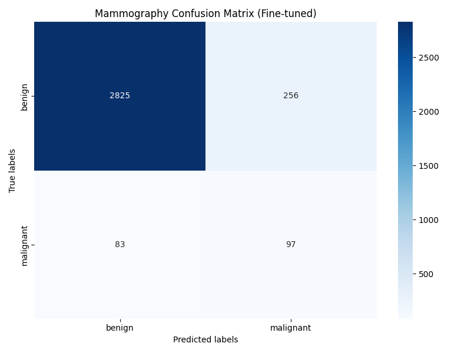
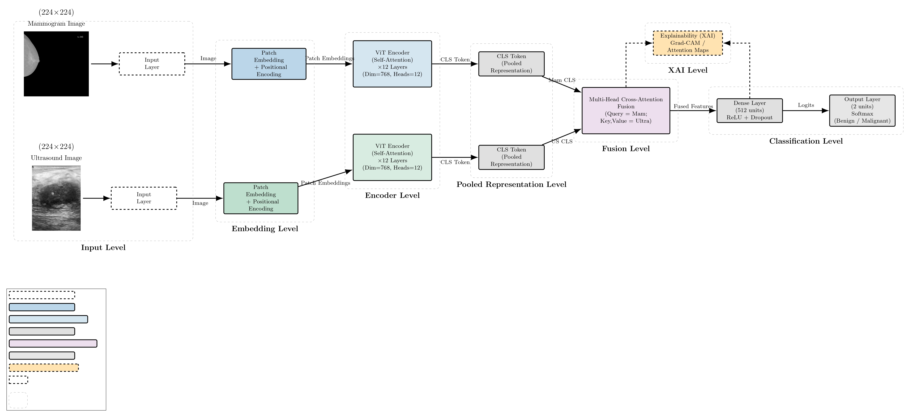
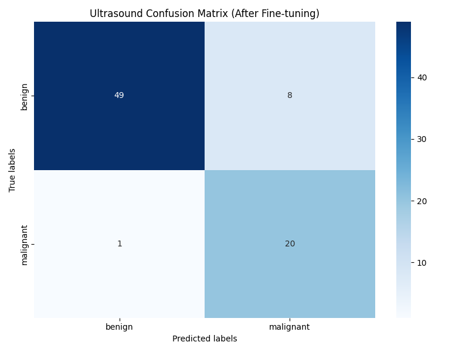

# MMIBC_MODEL: 맘모그래피와 초음파 영상을 활용한 멀티모달 유방암 판별 모델

This repository contains an implementation of a multimodal breast cancer classification model using **mammography** and **breast ultrasound** images.
본 저장소는 **맘모그래피(Mammography) 영상과 유방 초음파(Ultrasound) 영상을 함께 활용하여 유방암의 양성/악성 여부를 판별하는 멀티모달 인공지능 모델**을 구현한 프로젝트입니다.

기존 MMIBC 구조를 기반으로 하며, DINOv2 기반 특징 추출 모델을 활용하여 맘모그래피 영상과 초음파 영상의 특징을 각각 추출한 뒤, 두 영상 정보를 결합하여 최종적으로 **Benign(양성)** 또는 **Malignant(악성)** 클래스를 예측합니다.

또한 본 프로젝트에서는 초음파 영상의 병변 중심 정보를 더 효과적으로 반영하기 위해 **ROI 기반 Dual-ROI 구조**를 적용하였습니다.



*Fig: Mammography 단일 모델의 Confusion Matrix 결과 예시*

---

## 📖 Table of Contents

* [Project Overview](#-project-overview)
* [Key Features](#-key-features)
* [Model Architecture](#-model-architecture)
* [Datasets](#-datasets)
* [Repository Structure](#-repository-structure)
* [Results](#-results)
* [Installation](#-installation)
* [Usage](#-usage)
* [Web Application](#-web-application)
* [Limitations](#-limitations)
* [License](#-license)

---

## 📝 Project Overview

유방암 진단 과정에서는 맘모그래피와 초음파 영상이 널리 활용됩니다.
맘모그래피는 유방 조직의 전체적인 구조와 병변 의심 부위를 확인하는 데 사용되며, 초음파 영상은 병변의 형태와 내부 특징을 확인하는 데 장점이 있습니다.

본 프로젝트는 두 영상의 정보를 함께 활용하기 위해 **멀티모달 딥러닝 모델**을 구성하였습니다.
맘모그래피 영상과 초음파 영상을 각각 독립적인 encoder에 입력하여 특징을 추출한 뒤, 추출된 특징을 결합하여 최종적으로 양성 또는 악성 여부를 판별합니다.

본 연구의 주요 목적은 다음과 같습니다.

* 맘모그래피와 초음파 영상을 함께 활용한 유방암 양성/악성 판별
* 기존 MMIBC 모델 구조 재현 및 개선
* 초음파 ROI 정보를 활용한 병변 중심 특징 반영
* 악성 판별 성능 개선을 위한 모델 실험
* 향후 WEB 프로그램과 연동 가능한 AI 판별 시스템 구현

---

## ✨ Key Features

* **Multimodal Fusion**

  * 맘모그래피 영상과 초음파 영상을 함께 사용하여 각 영상 modality의 정보를 결합합니다.

* **DINOv2 Backbone**

  * Vision Transformer 기반의 DINOv2 모델을 사용하여 의료영상 특징을 추출합니다.

* **Dual-ROI Structure**

  * 초음파 원본 영상과 초음파 ROI 영상을 함께 활용하여 병변 중심 특징을 반영합니다.

* **Binary Classification**

  * 입력 영상에 대해 `Benign` 또는 `Malignant` 클래스를 예측합니다.

* **Confusion Matrix Visualization**

  * 모델의 분류 결과를 Confusion Matrix로 시각화하여 성능을 확인할 수 있습니다.

* **Web Application Plan**

  * React 기반 WEB 화면과 Python FastAPI 백엔드를 연동하여 AI 판별 결과를 제공할 수 있도록 설계할 수 있습니다.

---

## 🏗️ Model Architecture

본 프로젝트의 모델은 맘모그래피 영상과 초음파 영상을 함께 사용하는 멀티모달 구조를 기반으로 합니다.

기본적인 멀티모달 모델은 두 개의 영상 입력을 사용합니다.

```text
Mammography Image ──> Mammography Encoder ──┐
                                             ├──> Multimodal Fusion ──> Benign / Malignant
Ultrasound Image ───> Ultrasound Encoder ───┘
```

본 프로젝트에서 개선한 Dual-ROI 기반 모델은 초음파 원본 영상과 초음파 ROI 영상을 함께 사용합니다.

```text
Mammography Image ───────> Mammography Encoder ──────┐
                                                       │
Ultrasound Original Image ─> Ultrasound Encoder ───────┤
                                                       ├──> Multimodal Fusion ──> Benign / Malignant
Ultrasound ROI Image ─────> ROI Encoder ───────────────┘
```

Dual-ROI 구조는 초음파 영상의 전체적인 문맥 정보와 병변 중심 정보를 함께 반영하기 위한 구조입니다.
이를 통해 모델은 전체 초음파 영상에서 얻을 수 있는 정보와 ROI 영역에서 얻을 수 있는 세부 병변 특징을 동시에 활용할 수 있습니다.

> 모델 구조 이미지가 있는 경우 아래 경로의 이미지 파일명을 실제 파일명에 맞게 수정하여 사용할 수 있습니다.

```markdown

```

---

## 💾 Datasets

본 프로젝트에서는 두 가지 공개 의료영상 데이터셋을 활용하였습니다.

1. **VinDr-Mammo**

   * 맘모그래피 영상 데이터셋입니다.
   * 유방 X-ray 기반의 맘모그래피 이미지를 포함합니다.

2. **BUSI**

   * Breast Ultrasound Images Dataset입니다.
   * 유방 초음파 이미지를 포함합니다.

두 데이터셋은 동일 환자 및 동일 병변을 기준으로 직접 짝지어진 paired dataset이 아니기 때문에, 본 프로젝트에서는 라벨 정보를 기준으로 맘모그래피 영상과 초음파 영상을 구성하였습니다.

본 저장소에는 전체 원본 의료영상 데이터셋이 포함되어 있지 않습니다.
의료영상 데이터는 용량, 라이선스, 개인정보 보호 문제로 인해 별도로 준비해야 합니다.

현재 저장소의 `multimodal_CSV` 폴더에는 멀티모달 데이터 구성에 사용된 CSV 파일이 포함되어 있습니다.

```text
multimodal_CSV/
├── multimodal_pairs.csv
├── multimodal_pairs_no_mammo_leak.csv
├── multimodal_pairs_roi_margin030_no_mammo_leak.csv
├── multimodal_pairs_roi_no_mammo_leak.csv
└── removed_mammo_leak_rows.csv
```

---

## 📁 Repository Structure

현재 GitHub 저장소의 주요 구조는 다음과 같습니다.

```text
MMIBC_MODEL/
├── assets/
├── multimodal_CSV/
│   ├── multimodal_pairs.csv
│   ├── multimodal_pairs_no_mammo_leak.csv
│   ├── multimodal_pairs_roi_margin030_no_mammo_leak.csv
│   ├── multimodal_pairs_roi_no_mammo_leak.csv
│   └── removed_mammo_leak_rows.csv
│
├── notebooks/
├── src/
├── tools/
├── LICENSE
├── README.md
├── data_structure.json
├── doc.md
├── mammo_confusion_matrix.png
├── requirements.txt
└── ultrasound_confusion_matrix_2.png
```

각 폴더와 파일의 역할은 다음과 같습니다.

| Folder / File                       | Description                        |
| ----------------------------------- | ---------------------------------- |
| `assets/`                           | 모델 구조 이미지, 설명 이미지 등 프로젝트 관련 이미지 저장 |
| `multimodal_CSV/`                   | 멀티모달 데이터 페어링 CSV 파일 저장             |
| `notebooks/`                        | 실험 및 분석용 Jupyter Notebook 파일 저장    |
| `src/`                              | 모델 학습, 평가, 데이터 처리 관련 소스 코드 저장      |
| `tools/`                            | 보조 스크립트 및 유틸리티 코드 저장               |
| `data_structure.json`               | 데이터 구조 관련 정보                       |
| `doc.md`                            | 프로젝트 설명 문서                         |
| `requirements.txt`                  | 실행에 필요한 Python 라이브러리 목록            |
| `mammo_confusion_matrix.png`        | 맘모그래피 단일 모델 Confusion Matrix 결과    |
| `ultrasound_confusion_matrix_2.png` | 초음파 단일 모델 Confusion Matrix 결과      |

---

## 📊 Results

본 프로젝트에서는 맘모그래피 단일 모델, 초음파 단일 모델, 멀티모달 모델을 비교하여 실험을 진행하였습니다.

모델 성능 평가는 다음 지표를 활용하였습니다.

* Accuracy
* Precision
* Recall
* F1-score
* ROC AUC
* Confusion Matrix

특히 본 프로젝트에서는 악성 유방암을 놓치지 않는 것이 중요하므로, **Malignant Recall**을 중요한 평가 지표로 고려하였습니다.

### Mammography Confusion Matrix


### Ultrasound Confusion Matrix



최종 개선 모델은 맘모그래피 영상, 초음파 원본 영상, 초음파 ROI 영상을 함께 사용하는 Dual-ROI 기반 멀티모달 구조를 사용하였습니다.

학습된 최종 모델 가중치 파일은 용량 문제로 인해 본 저장소에 포함되어 있지 않습니다.

---

## ⚙️ Installation

To set up the project environment, follow these steps.

### 1. Clone the repository

```bash
git clone https://github.com/andykim1013/MMIBC_MODEL.git
cd MMIBC_MODEL
```

### 2. Create a virtual environment

```bash
python -m venv venv
```

Windows 환경에서는 다음 명령어로 가상환경을 활성화합니다.

```bash
venv\Scripts\activate
```

Linux 또는 macOS 환경에서는 다음 명령어를 사용할 수 있습니다.

```bash
source venv/bin/activate
```

### 3. Install dependencies

```bash
pip install -r requirements.txt
```

---

## 🚀 Usage

본 저장소에는 전체 원본 데이터셋과 학습된 모델 가중치 파일이 포함되어 있지 않습니다.
따라서 실제 학습 또는 추론을 실행하기 위해서는 별도의 데이터셋 경로와 모델 가중치 파일이 필요합니다.

일반적인 실행 흐름은 다음과 같습니다.

### 1. Data Preparation

* VinDr-Mammo 데이터셋과 BUSI 데이터셋을 준비합니다.
* 데이터 경로를 config 파일 또는 코드 내부 경로에 맞게 수정합니다.
* `multimodal_CSV` 폴더의 CSV 파일을 활용하여 멀티모달 데이터 구성을 확인합니다.

### 2. Training

모델 학습 코드는 `src/` 폴더 내부에 포함되어 있습니다.
학습 전 데이터 경로와 config 파일 설정을 확인해야 합니다.

예시 실행 흐름은 다음과 같습니다.

```bash
python src/training/dinov2/dual_roi_fusion/train_multimodal_dual_roi.py
```

### 3. Evaluation

학습된 모델을 평가할 때는 평가 스크립트와 모델 가중치 경로가 필요합니다.

```bash
python src/training/dinov2/dual_roi_fusion/evaluate_dual_roi_validation.py --model_path /path/to/your/model.pth
```

실제 실행 명령어는 사용자의 데이터 경로, 모델 경로, config 설정에 따라 달라질 수 있습니다.

---

## 🌐 Web Application

본 프로젝트의 모델은 향후 WEB 프로그램과 연동하여 사용할 수 있습니다.

WEB 적용 시 전체 구조는 다음과 같습니다.

```text
React WEB Frontend
        │
        ▼
Image Upload
        │
        ▼
ROI Selection
        │
        ▼
Python FastAPI Backend
        │
        ▼
PyTorch Model Inference
        │
        ▼
Benign / Malignant Prediction
```

본 Dual-ROI 모델은 다음 3가지 입력을 사용합니다.

```text
1. Mammography Image
2. Ultrasound Original Image
3. Ultrasound ROI Image
```

사용자 편의성을 고려할 경우, 실제 WEB에서는 사용자가 맘모그래피 이미지와 초음파 원본 이미지만 업로드하고, 초음파 화면에서 병변 의심 영역을 직접 선택하여 ROI 이미지를 생성하는 방식으로 구현할 수 있습니다.

예상 결과 반환 형식은 다음과 같습니다.

```json
{
  "prediction": "malignant",
  "benign_probability": 0.23,
  "malignant_probability": 0.77
}
```

---

## ⚠️ Limitations

본 프로젝트는 연구 및 학습 목적으로 개발된 AI 모델입니다.

AI 모델의 예측 결과는 의료진의 진단을 대체할 수 없습니다.
실제 질병 판단 및 치료 결정은 반드시 전문 의료진의 판독과 상담을 통해 이루어져야 합니다.

또한 의료영상 데이터는 민감한 개인정보에 해당할 수 있으므로, 데이터 사용 및 공유 시 개인정보 보호와 데이터 라이선스를 반드시 확인해야 합니다.

본 저장소에는 다음 파일이 포함되어 있지 않습니다.

```text
- 전체 원본 의료영상 데이터셋
- 학습된 최종 모델 가중치 파일
- 대용량 실험 결과 파일
```

필요한 데이터와 모델 가중치는 별도로 준비한 뒤 프로젝트 경로에 맞게 배치해야 합니다.

---

## 📜 License

본 프로젝트의 라이선스 정보는 `LICENSE` 파일을 참고하십시오.

---

## 👤 Author

* Repository: `MMIBC_MODEL`
* GitHub: `andykim1013`
* Project: Multimodal Breast Cancer Classification using Mammography and Ultrasound

---

## 📚 Reference

This project is based on the concept of multimodal breast cancer classification using mammography and ultrasonography datasets.

```bibtex
@inproceedings{adekoya2025mmibc,
  title={Explainable Multimodal Imaging for Breast Cancer Diagnosis Using Mammography and Ultrasonography Datasets},
  author={Adekoya, Testimony Oluwanifemi},
  booktitle={Conference or Journal Name},
  year={2025}
}
```